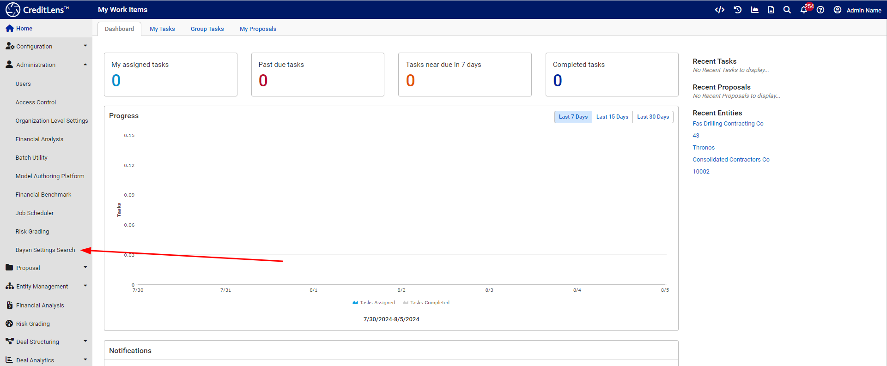
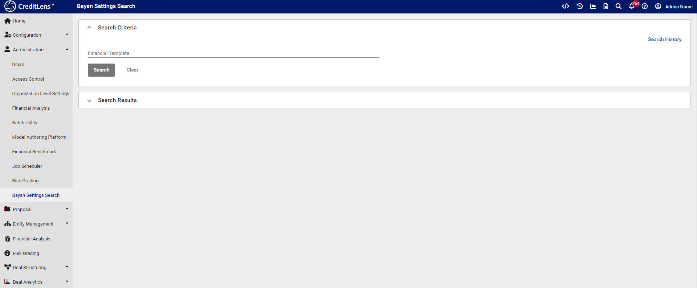
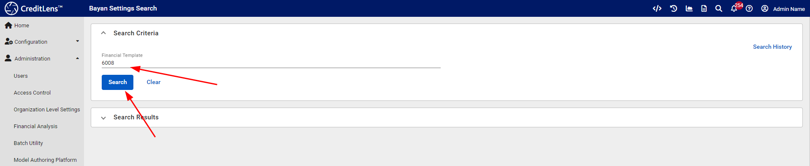
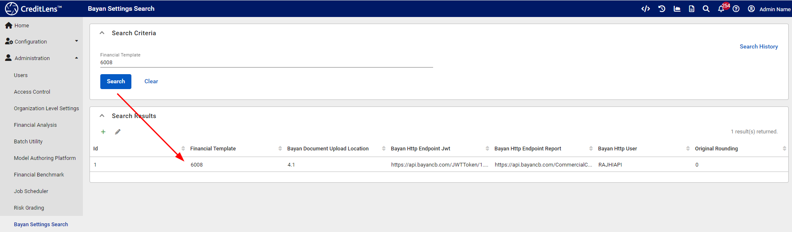
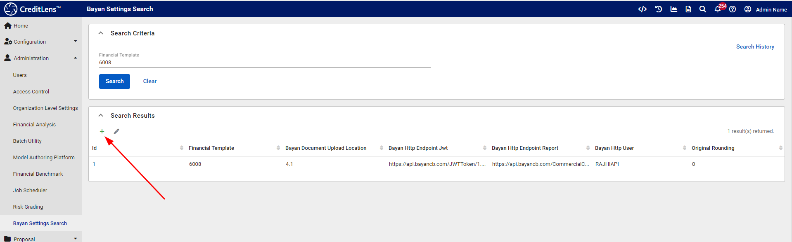
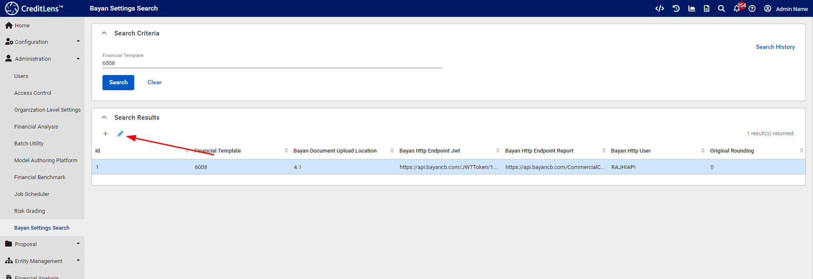
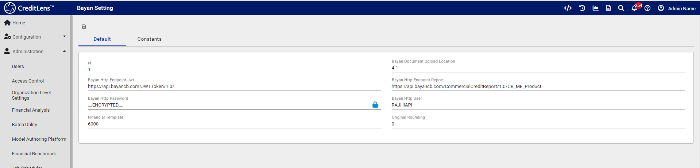

# Configuring Bayan

Assuming the CreditLens configurations have been applied, either via RMIG Migrations or moving a Tenant, the Bayan
settings are
available via Administration >>> Bayan Settings Search:

Clicking on the Bayan Settings Search allows for the expansion of a page that searches for Bayan Configurations for
various financial templates.

To proceed, the Financial Template Id is required, where in this example, 6008 for MMAS is to be used. Start by
searching is a
configuration for MMAS already exists:

In the above case, the MMAS template has already been created:

In the absence of a record, it can be added with a click on the plus icon:

In this example, click on the existing record, and then the pen icon to edit:

On opening the edit page, the Bayan Settings are available for update:

The following fields are available and are intended to describe the integration for a given financial template, such as
MMAS:

| Setting                        | Description                                                                      | Example                                                          |
|--------------------------------|----------------------------------------------------------------------------------|------------------------------------------------------------------|
| Bayan Http Endpoint Jwt        | The location for Bayan Authentication lifted from the API specification.         | https://api.bayancb.com/JWTToken/1.0/                            |
| Bayan Document Upload Location | The file directory location for PDF uploads.                                     | 4.1                                                              |
| Bayan Http Endpoint Report     | The location for Bayan Credit Report Retrieval lifted from the API specification | https://api.bayancb.com/CommercialCreditReport/1.0/CB_ME_Product |
| Bayan Http Password            | The password for the Bayan endpoint.                                             | Secret                                                           |
| Bayan Http User                | The user for the Bayan endpoint.                                                 | User.                                                            |
| Financial Template             | The financial template that these settings relate to.                            | 6008                                                             |
| Original Rounding              | Reserved for future use.    Must be zero.                                        | 0                                                                |

On invocation of the Bayan link,  a lookup will be made, matching on the Financial Template (6008 in the case of MMAS).

For that instantiation of the Bayan link, and given a matching template, the above settings will be used.