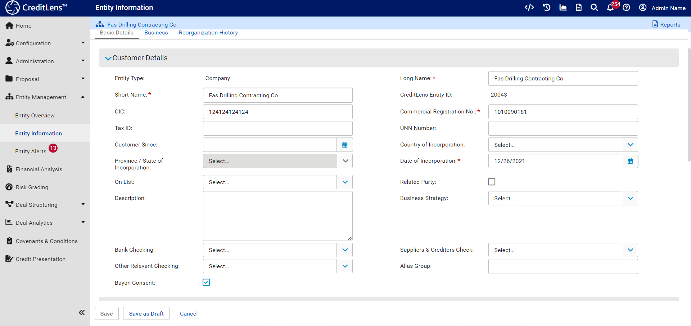
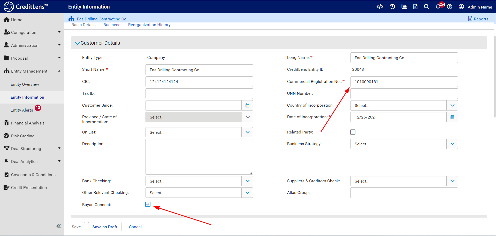

# Entity Configuration

In the Entity Edit page, which is accessible on having set the Entity context via Entity Management >>> Entity
Information
and the submenu item Customer Details:

Note the fields Commercial Registration No and Bayan Consent:

Both of these fields need to be applied:

| Name                        | Description                                                                                   | Required | Example   |
|-----------------------------|-----------------------------------------------------------------------------------------------|----------|-----------|
| Commercial Registration No. | The Saudi Arabian Commercial Registration Number.                                             | Yes      | 123456789 | 
| Bayan Consent               | A flag indicating that consent has been given by the customer to fetch statements from Bayan. | Yes      | Yes       |

In the absence of Bayan Consent having been selected the statement fetch process will fail.

The statement fetch process is predicated upon the Commercial Registration Number provided.