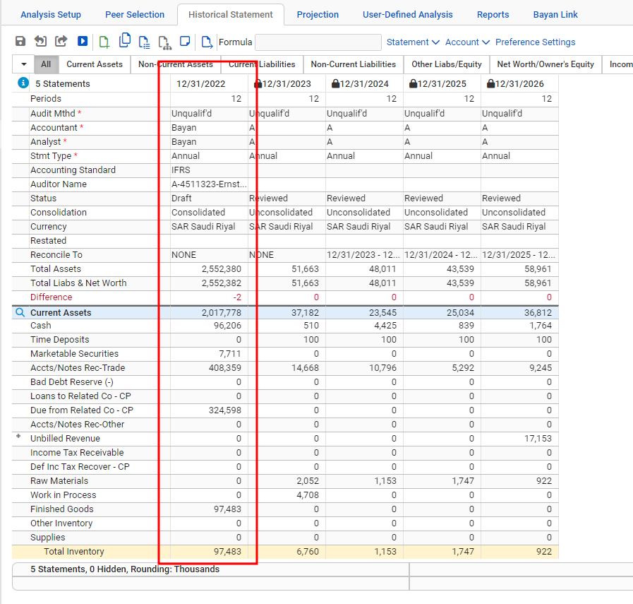
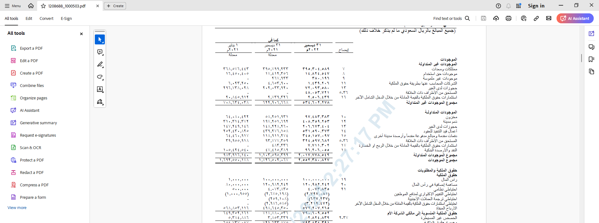

# Bayan Integration
The Bayan Integration makes a connection to the Bayan Credit Bureau in Saudi Arabia which is a repository of Financial Statements
for both public and private companies.

Given the availability of financial statements in a structured format, the accounts can be mapped to the CreditLens spreading grid:

Furthermore, and in addition to the automated spreading set out above, a PDF for the original financials is rendered,  and uploaded
to the CreditLens document management system:

The value proposition for a bank is that they can greatly reduce spreading time and instead focus on the review of the PDF
financials for auditors notes and annotations, with the bulk of the spreading being done.

The process of spreading financial statements with the Bayan link is as follows:

* Prepare the Entity by updating Bayan Consent and ensuring that Commercial Registration Number is specified in the correct format.
* Request a list of available statements from Bayan.
* Select individual statements ro be spread to a CreditLens financial template (e.g. MMAS).
* Update the Financial Statements given auditors annotations taken from the PDF financial statements.

The Bayan Integration relies upon two components to be installed and running:

* RMIG running and accepting RPC on localhost port 5079 (i.e. http://localhost:5079).
* A custom dll that is intended to emit RPC messaging based upon the clicking of buttons in the CreditLens user interface.