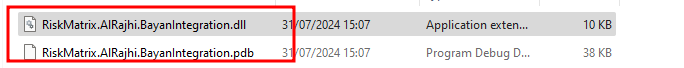
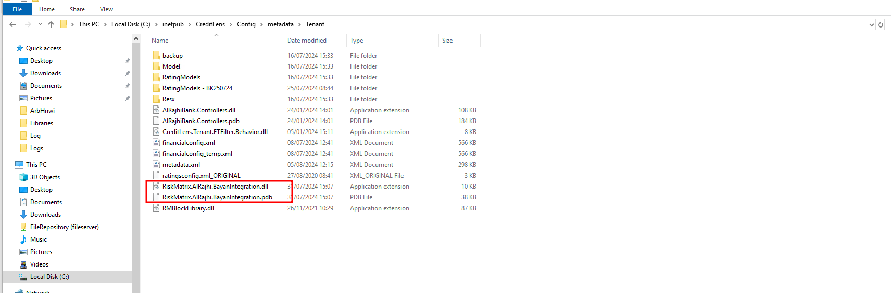

# Installing the required DLL for Bayan RPC
The lightweight DLL for Bayan RPC to RMIG is contained within the following GitHub repository:

https://github.com/RiskMatrixIrms/BAYAN-POC

The software builds a DLL that is compatible with CreditLens,  which is to say that it may be loaded into its Dependency 
Injection Autofac Container, allowing for overriding oa native CreditLens functionality, 
which in this case is the clicking of buttons in the Bayan Link tab.

The compiled dll is:

* RiskMatrix.AlRajhi.BayanIntegration.dll
* RiskMatrix.AlRajhi.BayanIntegration.pdb

Move the above files to:

C:\inetpub\CreditLens\Config\metadata\Tenant

In the event that a Tenant file is being migrated representation a working installation of RMIG and the Bayan functionality,  
the dll will already be included in that Tenant file.  It follows that this step may well be the validation of the existence of this
required RPC binary.