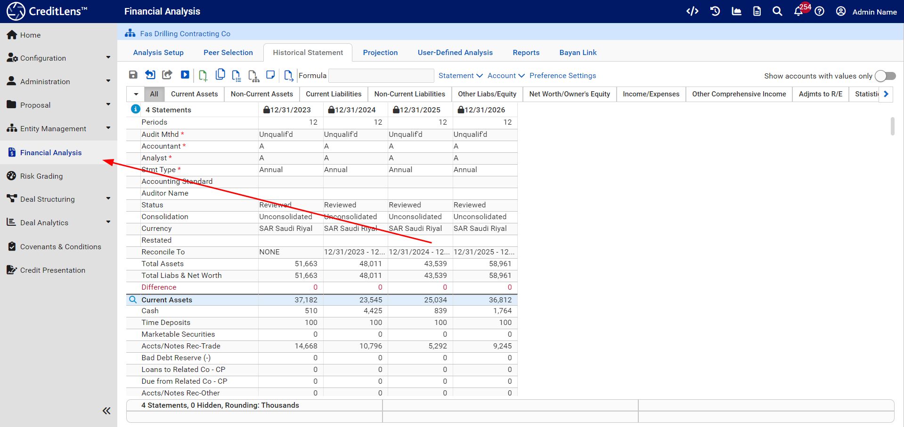
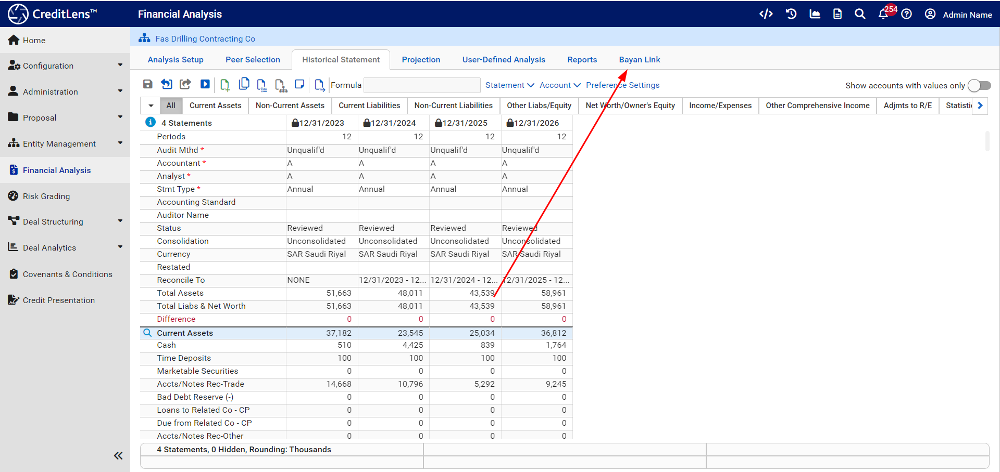
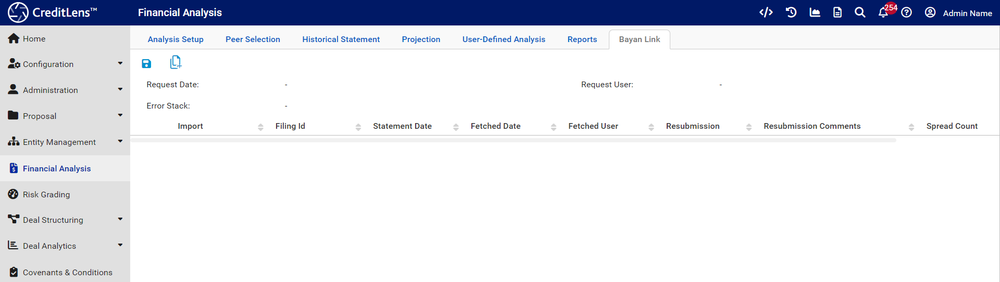
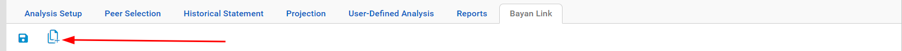
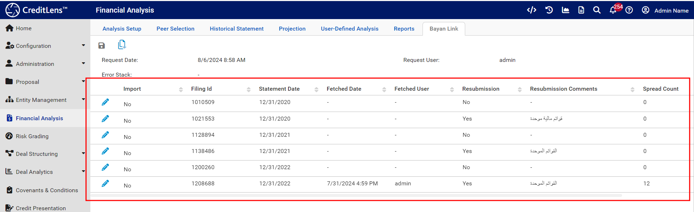

# Fetching a list of available statements
Once an Entity Id has been placed in the context,  Bayan spreading automation may take place in two steps:

* A list of all available statements having been returned from Bayan.
* A selection made for each statement that requires spreading.

In all the above cases, spreading is only available if the Financial Analysis has been configured to use a Financial Template.

Given an Entity Id in context, navigate to Financial Analysis:

Note the Bayan Link tab:

Click on the Bayan Link tab:

Note the button indicating add as follows:

Click this button to connect to Bayan and return all available statements recorded after 2019:

The statements are now available to spread.