# Spreading a Bayan Statement
Upon financial statement availability having been determined, note the edit buttons alongside each financial statement:

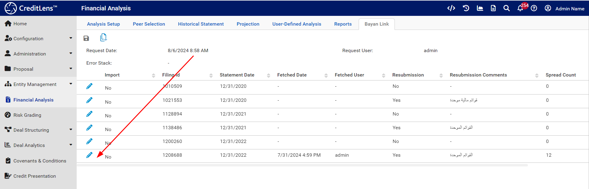

Click on the pen icon to bring about the edit of the financial statement,  or rather the setting of a flag to instruct the
automated spreading of a financial statement:

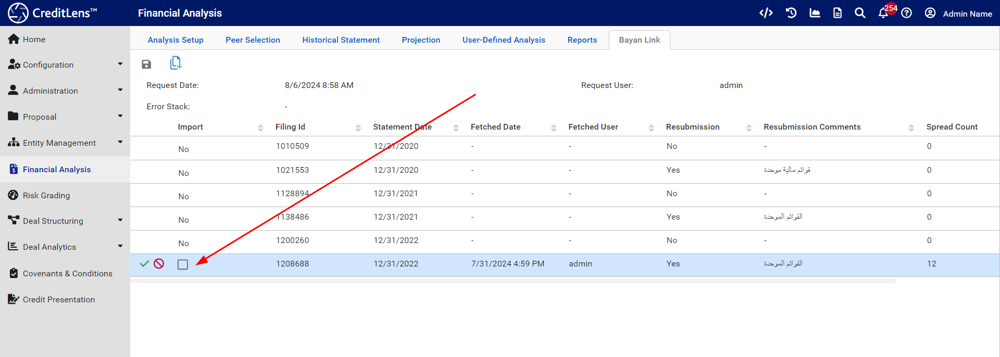

Select the checkbox to mark the financial statement as pending spreading:

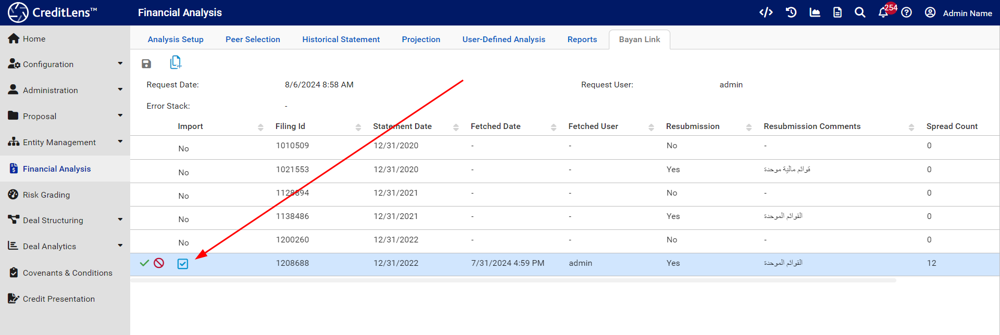

Check the green tick box to conclude the staging:

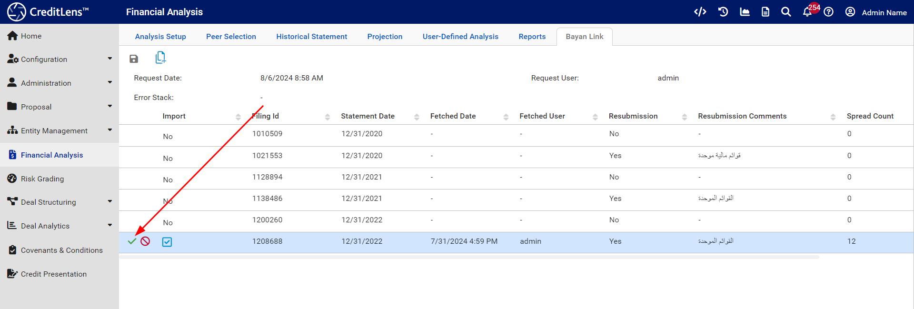

Upon conclusion of the staging, note the save icon:

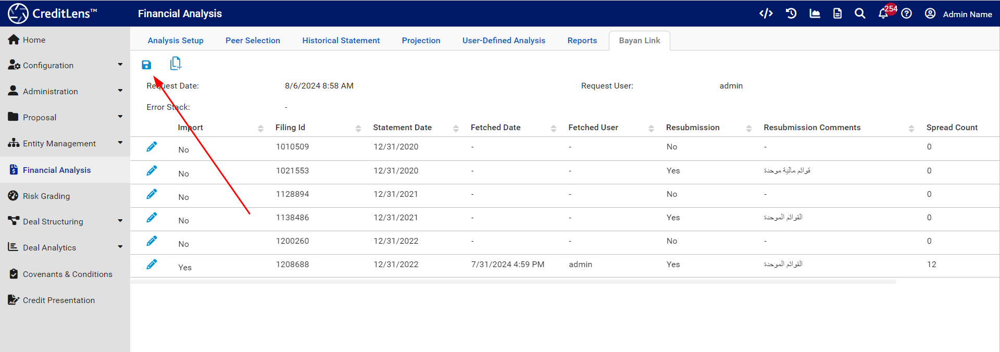

Click the save icon, and wait for confirmation of save:

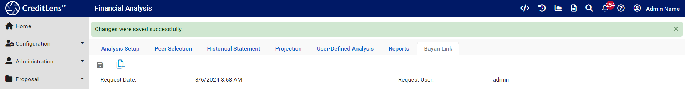

Navigate to the Historical Statement tab:

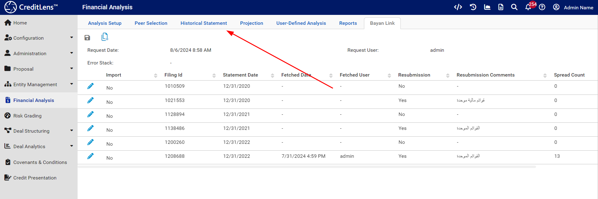

Note the financial statement having been spread:

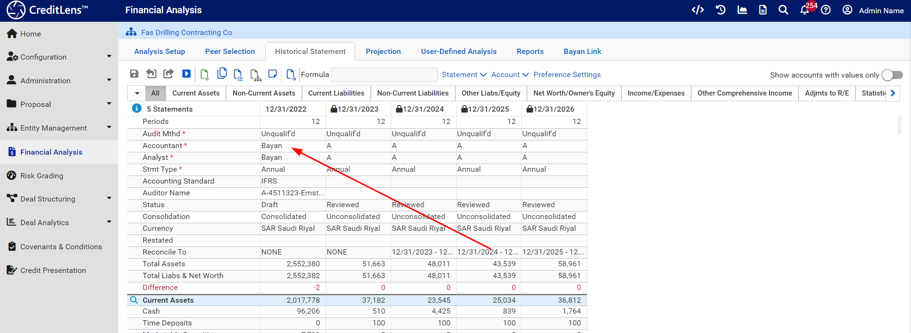

The statement is available for updates based upon the contents of the original financial statements.

The original financial statements are rendered as a PDF and uploaded to the Document Management section of Credit Lens.
Navigate via the main menu:

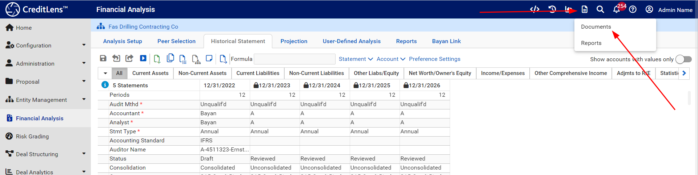

The PDF if in this example is stored under Financial and Compliance >>> Annual Financials:

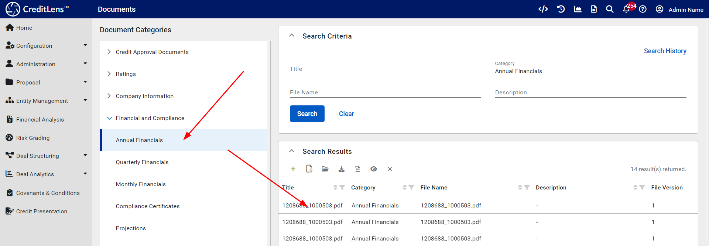

The file name is structures as being the Entity Id context, underscore, then the Commercial Registration number:

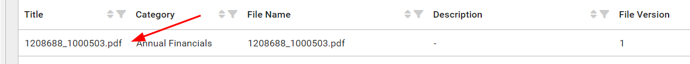

The PDF file at this stage can be viewed of downloaded as part of functionality made available by the Document Management module:

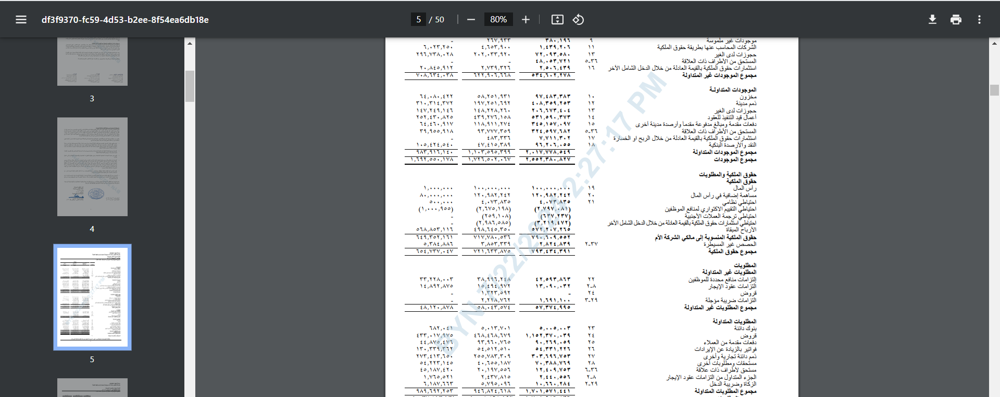

The practical implication is that a Relationship Manager (RM) would read the financial statements and then set about breaking out account balances
based upon auditors notes and annotations.