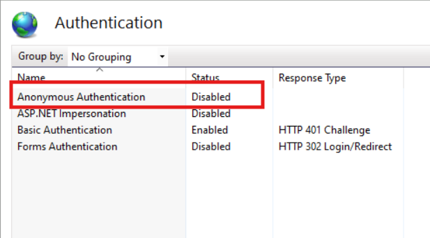

# Deployment Guide for .NET 8 Web Application on IIS

## Introduction
This document provides a step-by-step guide for deploying a .NET 8 web application on IIS and enabling Basic Authentication.

## Prerequisites
- Windows Server with IIS installed.
- .NET 8 Hosting Bundle installed on the server.
- A .NET 8 web application ready for deployment.

## Useful links
- .NET 8 Runtime: https://dotnet.microsoft.com/en-us/download/dotnet/8.0
- .NET 8 Hosting Bundle: https://dotnet.microsoft.com/en-us/download/dotnet/thank-you/runtime-aspnetcore-8.0.8-windows-hosting-bundle-installer

## Deploying the Web Application

### Publish the Application
1. Open your .NET 8 project in Visual Studio.
2. Right-click on the project in Solution Explorer and select **Publish**:   
3. Select **Folder**, and Specify a folder path where the published files will be saved:      
5. Click **Publish** to build and publish your application.

### Create a New Site in IIS
1. In IIS Manager, right-click on **Sites** and select **Add Website**:    
2. Fill in the **Site name**, **Physical path** (point to the folder where you published your application), and **Binding** settings:   
3. Click **OK** to create the site.

## Enabling Basic Authentication in Windows Features

To use Basic Authentication, you must ensure the feature is enabled:

1. Open **Control Panel**.
2. Click on **Programs**:  
3. Click on **Turn Windows Features on or off**:  
4. Go to **Internet Information Services-> World Wide Web Services-> Security** and make sure **Basic Authentication** is checked:  

## Adding Basic Authentication

### Enable Basic Authentication
1. In IIS Manager, select your web application.
2. Double-click on **Authentication** in the middle pane:  
3. Disable **Anonymous Authentication**:  
4. Enable **Basic Authentication**:  

### Step 2: Configure Users
1. Open **Computer Management**.
2. In the left menu, expand **Local Users and Groups**:  
3. Right-click on **Users** and select **New User ...**:  
4. Fill-out the user's informations and click **Create**:  

## Testing the Deployment
1. Open a web browser and navigate to your site’s URL.
2. You should see a prompt for a username and password :  
3. Enter the credentials of a user you configured in IIS.
4. Verify that the application loads successfully after authentication.  
- In the case of failed authentication, you will receive a 401 error, as shown below:  
- Otherwise, you will receive a proper response from the API, as shown below:  