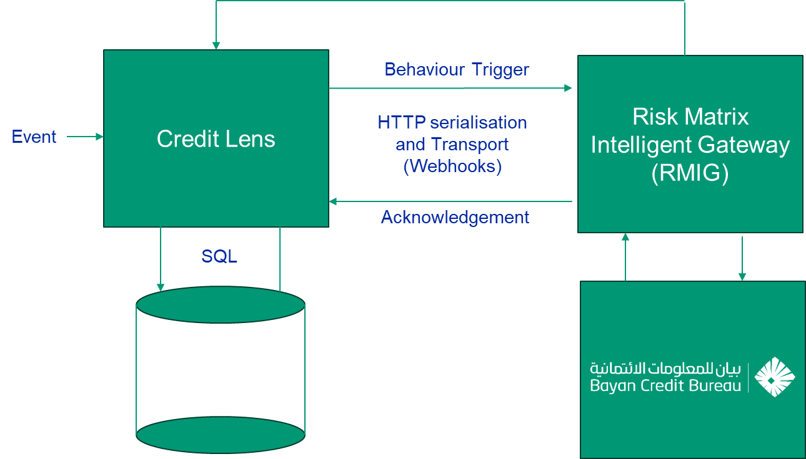
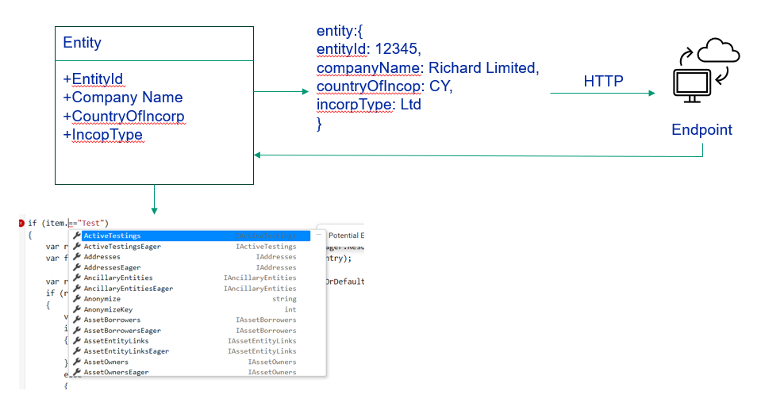
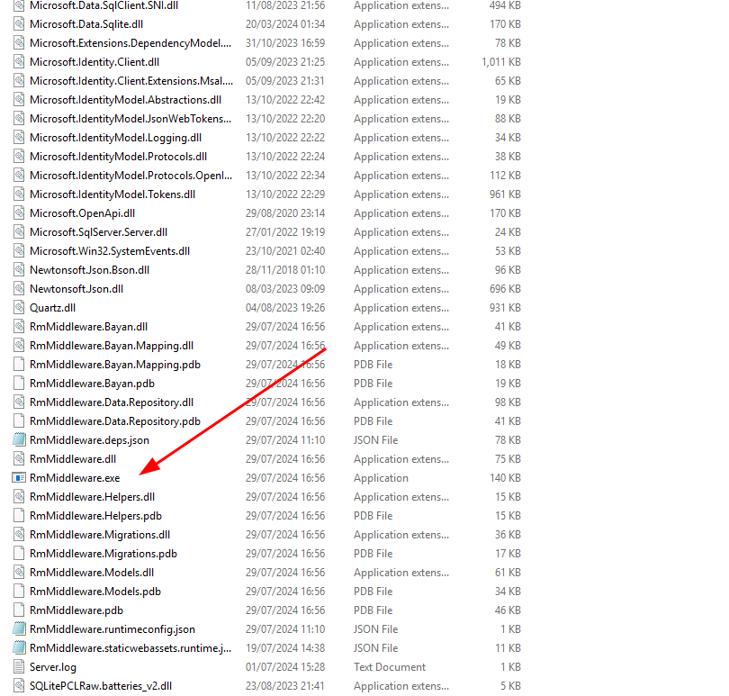

# Introduction Risk Matrix Intelligent Gateway Documentation (RMIG)

The Risk Matrix Intelligent Gateway (RMIG) is middleware software that provides ancillary service to Moody's Credit Lens
software. Moody's CreditLens is somewhat inflexible in the manner it can be extended, which is compounded when it is
deployed in a managed services (aka cloud) arrangement. RMIG allows for the offloading of functionality to middleware
that is written in modern standards (.Net 8) relying on lightweight interoperability, an unobtrusive integration
layer for Moody’s CreditLens:

* An interoperability, reporting, analytics and AI layer.
* Fully compliant with – agnostic to - Moody’s cloud compliance.
* Written in modern frameworks using modern patterns.
* Greatly reduce implementation project complexity.
* Allows for greater compliance with bank security policies.

## Functional Architecture and Flows

The following diagram details the software architecture:

In the above diagram the target of integration and interoperability is the Bayan Credit Bureau, a reasonably standard
REST endpoint albeit with extremely complex response payloads. The above diagram has the following components,
in an order that described their flow and collaboration:

| Order | Name                                   | Description                                                                                                                                                                                                                                                                                                               |
|-------|----------------------------------------|---------------------------------------------------------------------------------------------------------------------------------------------------------------------------------------------------------------------------------------------------------------------------------------------------------------------------|
| 1     | CreditLens                             | The CreditLens software which is extensible to emit json via REST protocols with JSON payload where appropriate.                                                                                                                                                                                                          |
| 2     | Behaviour Trigger                      | The methodology calls upon the interception of most CreditLens events and behaviours and the ability to synchronously make Remote Procedure Call (RPC) to RMIG. RPC is not well supported in CreditLens at this time and requires the deployment of very lightweight custom DLL's.                                        |
| 3     | RMIG                                   | RMIG is a HTTP endpoint which listens for REST RPC calls, henceforth HTTP GET or POST (with JSON payload for serialisation).                                                                                                                                                                                              |
| 4     | Upstream Service                       | Upstream services have their own protocols and formats for the purpose of RPC.  In the above example, the RPC relates to Bayan integration via REST API,  GET and POST, in all cases using JSON payloads for serialisation.                                                                                               |
| 5     | Transactional API \ Out of the Box API | Updating of data in CreditLens may only happen via the supported API's.  Transactional API references to the use of CreditLens as if it were a collection of RPC methods (commonly looked upon as being akin NoSQL database interface where special functionality not required, rather simply database persistence).      | 
| 6     | Acknowledgement                        | Given that RPC is synchronous, an acknowledgement needs to be sent back.  In the event that HTTP status code 200 is sent, this will allow for continuation of the CreditLens process.  In the case of a WebException (anything other than 200) will cause the termination of the CreditLens process and display an error. |

RPC is currently JSON over HTTP:

## Prerequisites

RMIG is written in the latest .Net framework. RMIG supports any Operating System that is supported by the .Net 8
runtime.

The following .Net 8 resources need to be installed to the server running RMIG, making its interfaces available for RPC:

* .NET Runtime 8.0.7.
* ASP.NET Core Runtime 8.0.7.

RMIG is shipped as zip bundle containing all other dependencies required to run RMIG. On the prerequisites above being
available,
simply unpacking the zip into the file system constitutes the installation process:

Subject to additional [Installation](Installation/Index) required in the form of:

* Environment Variables.
* Logging Levels and Logging Locations.

The RMMiddleware.exe binary will otherwise execute.