# Installation

The following steps describe the installation of RMIG.

The following .Net 8 resources need to be installed to the server running RMIG, making its interfaces available for RPC:

* .NET Runtime 8.0.7.
* ASP.NET Core Runtime 8.0.7.

The following assumed the installation of the .Net prerequisites.

## Copy RMIG Bundle and Unzip

Copy the RMIG bundle from the release location and copy to the target installation location. In the following example
the
bundle has been coped to c:\RMIG (a new directory created for the purpose of hosting RMIG):

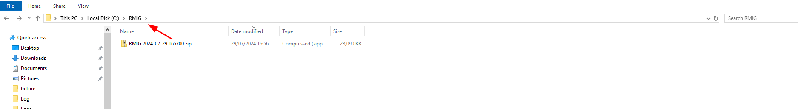

In a proper release the bundle may be named differently and include a version number.

Unpack \ Unzip the RMIG zip file:

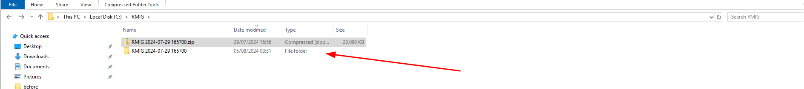

Navigate inside the bundle, win-64 and note the executable RMMiddleware.exe:

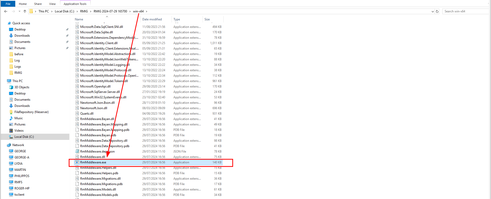

The RMMiddleware.exe will be run from the command line rather than a mere double click.

The RMMiddleware will not run unless Environment Variables have been set as follows.

# Set the Environment Variables

For reasons of compatibility with Docker or other containerisation technologies parameters are passed in favor or
traditional
command line parameters. RMIG in fact has no command line interface.  
Some Environment Variables can be overridden by taking their settings from settings made available in CreditLens,
although there are some that are absolutely required for the startup of the application.

The following Environment Variables are available:

| Name                       | Description                                                                                                                                                                                                                                                                                                                                                                                                                              | Required | Example                                                          |
|----------------------------|------------------------------------------------------------------------------------------------------------------------------------------------------------------------------------------------------------------------------------------------------------------------------------------------------------------------------------------------------------------------------------------------------------------------------------------|----------|------------------------------------------------------------------|
| CREDITLENS_HTTP_ENDPOINT   | The location of the CreditLens software.                                                                                                                                                                                                                                                                                                                                                                                                 | Yes      | http://localhost                                                 |
| CREDITLENS_HTTP_USER       | The CreditLens user to be used for API authentication.                                                                                                                                                                                                                                                                                                                                                                                   | Yes      | admin                                                            |
| CREDITLENS_HTTP_PASSWORD   | The CreditLens password to be used for Password autehntication.                                                                                                                                                                                                                                                                                                                                                                          | Yes      | secret                                                           |
| BAYAN_HTTP_USER            | The Bayan user to be used for API authentication.                                                                                                                                                                                                                                                                                                                                                                                        | No       | bank                                                             |
| BAYAN_HTTP_PASSWORD        | The Bayan password to be used for API authentication.                                                                                                                                                                                                                                                                                                                                                                                    | No       | secret                                                           |
| BAYAN_HTTP_ENDPOINT_JWT    | The URL for API authentication at Bayan.                                                                                                                                                                                                                                                                                                                                                                                                 | No       | https://api.bayancb.com/JWTToken/1.0/                            |
| BAYAN_HTTP_ENDPOINT_REPORT | The URL for Credit Report calls at Bayan.                                                                                                                                                                                                                                                                                                                                                                                                | No       | https://api.bayancb.com/CommercialCreditReport/1.0/CB_ME_Product |
| BAYAN_AUTHENTICATION       | A flag if true indicating is authentication should be sought for Bayan or if false the endpoint is unauthenticated thus managing the authentication token itself.                                                                                                                                                                                                                                                                        | No       | True                                                             |
| BAYAN_CHANNEL_ID_HEADER    | A flag if true indicating if the header ‘ChannelID’=’Credit Lens’ should be added to the HTTP requests for Bayan.                                                                                                                                                                                                                                                                                                                        | No       | False                                                            |
| BAYAN_ORIG_ROUNDING        | Reserved for future use.  Value must be 0.                                                                                                                                                                                                                                                                                                                                                                                               | No       | 0                                                                |
| BAYAN_UPLOAD_LOCATION      | The location in the CreditLens document management system for the uploading of the Bayan PDF file.                                                                                                                                                                                                                                                                                                                                       | No       | 4.1                                                              |
| ASPNETCORE_URLS            | The binding for the RMIG web service for Remote Procedure Calls (RPC).                                                                                                                                                                                                                                                                                                                                                                   | Yes      | http://localhost:5079                                            |
| HTTP_PROXY                 | Has the effect of suppressing certificate errors on any outbound HTTP Remote Procedure Calls (RPC).  Useful when RPC being made given self signed certificates on proxies.  It is important to understand that if this is selected all http comunications must be https,  for both CreditLens and any external service.  Hence,  if CreditLens is not running under a signed certificate, a self signed certificate must be implemented. |

**Note:** After the environment variables are added, you must reset the IIS server using the command `iisreset` in the terminal for the new variables to be discovered by IIS.  

That an Environment Variable might not be required for the instantiation of RMIG, this does not imply that it might
not be required for the functioning of various functionality in the RMIG software. For example, in the case of the Bayan
link,
while it Environment Variables are not required for the RMIG software to start, they may well be required for the
functionality of that functionality, in which case there will be a settings page exposed in CreditLens:

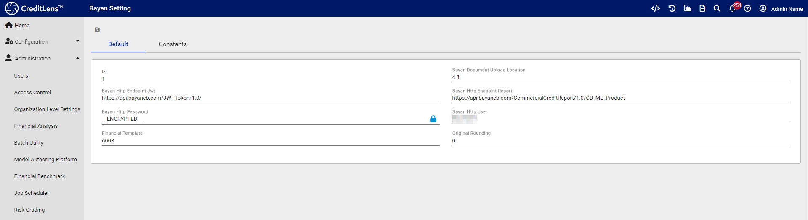

CreditLens settings will in all cases override Environment Variables.

Given that the software will be installed as a Windows Service as follows, it is important to set these Environment
Variables at the System level:

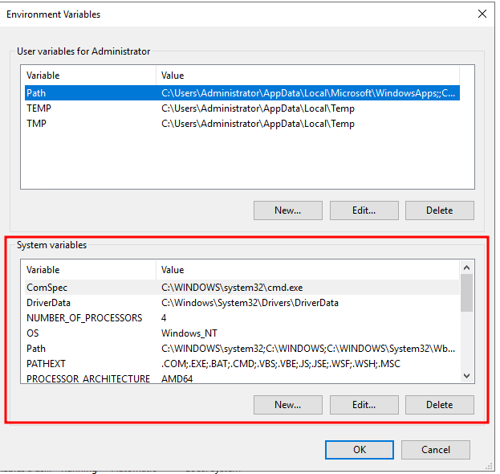

For example:

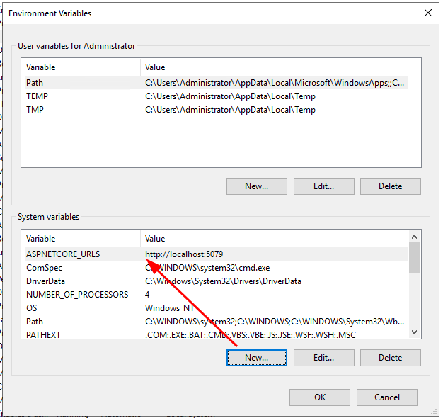

## Configure Logging

Inside the RMIG software there exists a file called log4net.config:

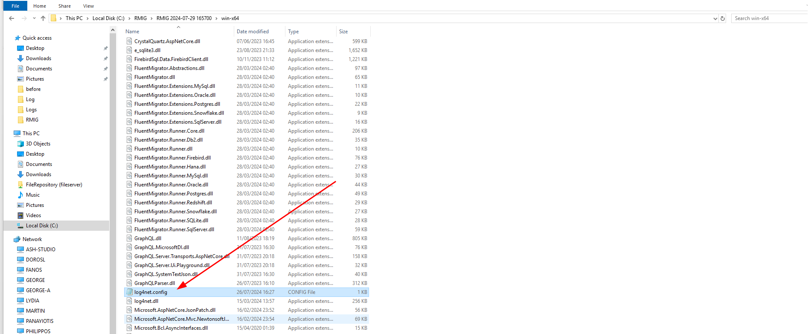

Open this file to locate the logging configuration:

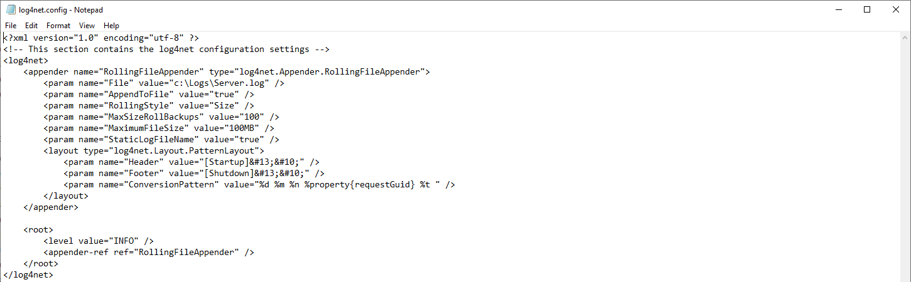

Ensure that the logging level is set to INFO:

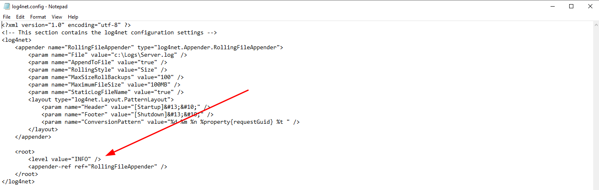

Ensure that an appropriate directory location has been configured for the purpose of writing logs:

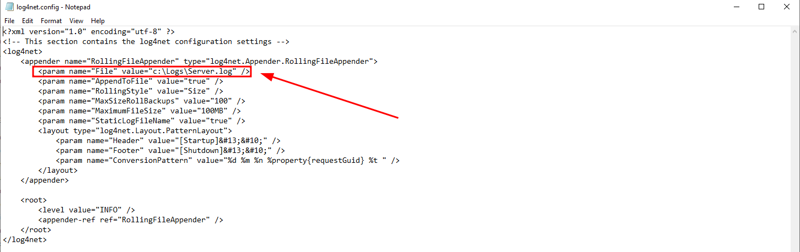

In the above example, the logs will be written to c:\Logs\ and a file called Server.log which will rotate depending on
size.

## Move Configuration Database If Required

RMIG on startup will perform Migrations which is responsible for the creation of objects inside CreditLens or other
databases.

RMIG will store its migration state in a database in the application directory called configuration.db:

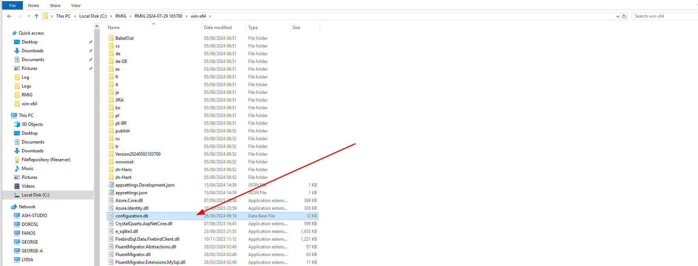

It is important to note that the configuration database must be an exact match with the state of CreditLens. For
example, if a tenant is being
shipped that has the configuration already, then migrations will fail.

Henceforth, the configuration.db file might need replacing given migrations having been applied already.

## Temporary Measure:  Install Non Sucking Service Manager (NSSM)

Early versions of RMIG do not have support for Windows Services. Longer term the intention is to deploy RMIG as a series
of
Docker containers given the need to provide for interoperability between .Net and Python services. It follows that it is
not anticipated that Windows Service wrappers will be supported long term.

Download and install the NSSM from the following location:

https://nssm.cc/download

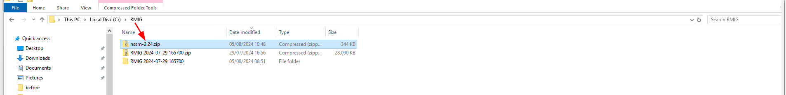

Unpack the zip file:

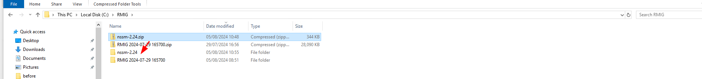

Navigate to expose the executable for the operating system:

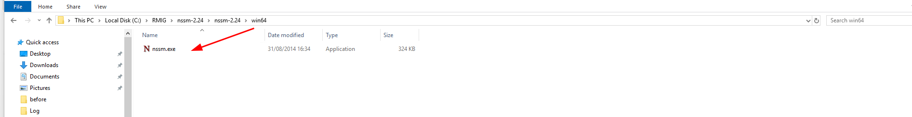

Execute the nssm.exe file to expose usage instructions:

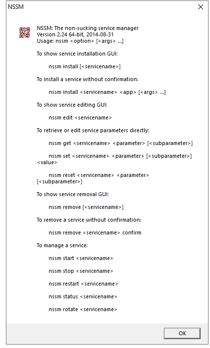

In this case, install RMIG using the following pattern to start nssm from the command line. Firstly, navigate to the
same directory in command:

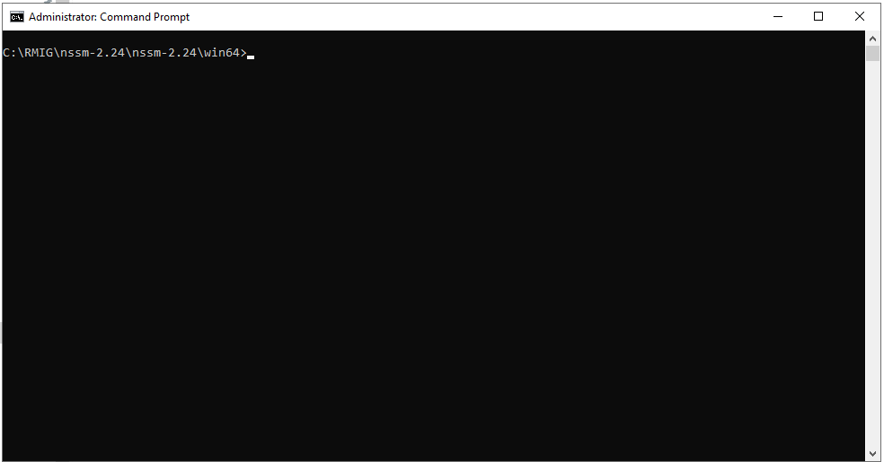

Execute the command:

nssm.exe install "RMIG"

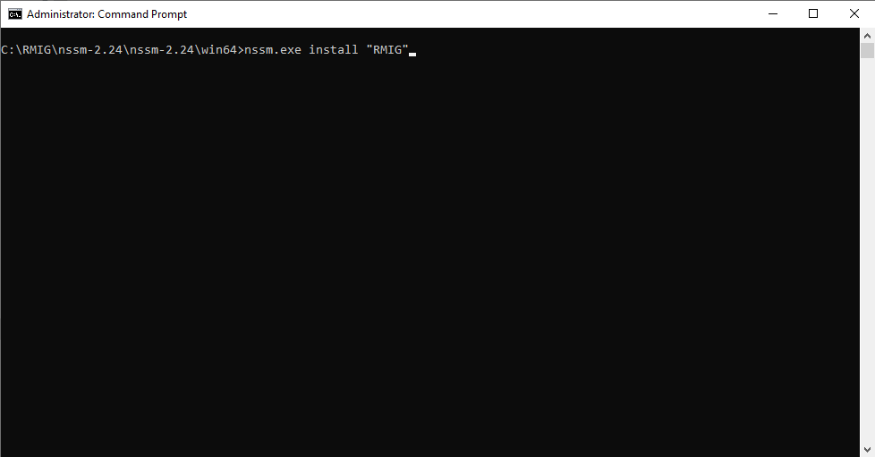

The command will launch the NNSM installation interface:

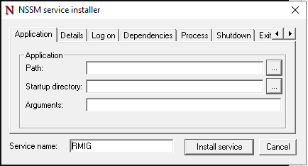

In the installation interface, retain the defaults, and simply enter the path to RMIG:

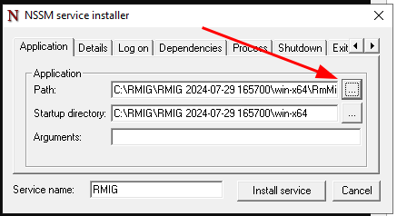

Once the path to the RMMiddleware executable has been specified, click Install Service:

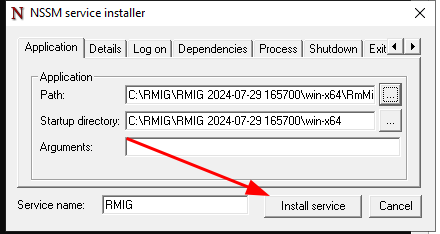

Await confirmation:

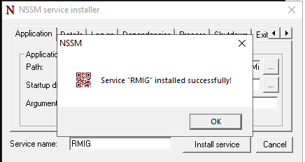

Validate that the service is available for startup:

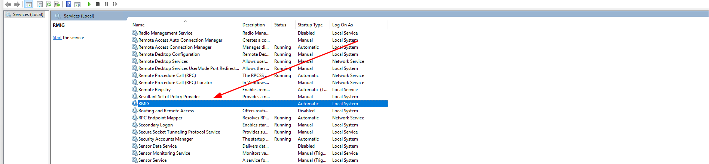

Start the service:

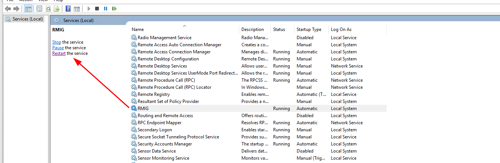

# Verify Logs to ensure RMIG Operation

Given RMIG will feedback in logs contained, in the example, c:\Logs\ navigate to that directory:

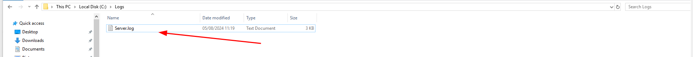

Open the file to verify that RMIG has started and it is logging its state:

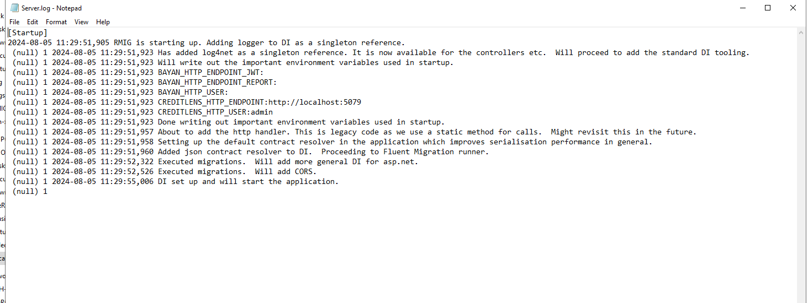
